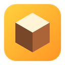
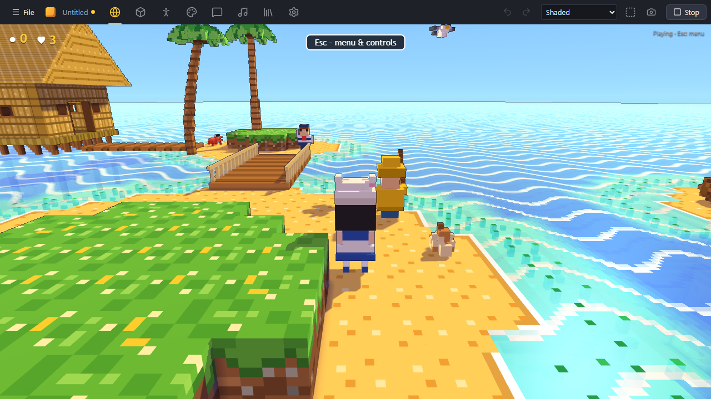

# Voxbit

**A voxel editor and engine for 3D platformers.**
Build blocks and characters voxel by voxel, paint maps, add dialogs and music, and play your game right away.

&nbsp;
<a href="https://github.com/adrianderstroff/voxbit-releases/releases/latest/download/Voxbit-Player-Windows.zip"><picture><source media="(prefers-color-scheme: dark)" srcset="assets/download-player-dark.svg"></picture></a>
&nbsp;
<a href="https://adrianhasa.blog/misc/2026-09-voxbit/editor/"><picture><source media="(prefers-color-scheme: dark)" srcset="assets/web-editor-dark.svg"></picture></a>

---

> [!NOTE]
> Voxbit is an **early preview**. Things will change and break, and project files may need updating between versions. Bugs and ideas are welcome in the [issues](https://github.com/adrianderstroff/voxbit-releases/issues).

## Downloads

The buttons above always get the newest build. Older builds are on the [releases page](https://github.com/adrianderstroff/voxbit-releases/releases).

| | What it is | How to start it |
|---|---|---|
| **Voxbit-Editor-Windows.zip** | The editor | Unzip it and start `Voxbit Editor.exe` |
| **Voxbit-Player-Windows.zip** | The player, with a small scene to walk around in | Unzip it and start `Voxbit Player.exe` |

**Requirements:** Windows 10 or 11 (64-bit) with WebView2 (part of Windows 11) and a graphics card with WebGPU support.

> [!IMPORTANT]
> The programs are not signed yet, so Windows SmartScreen may say *"Windows protected your PC"*. Click **More info → Run anyway**.

## Ship your own game

1. In the editor, choose **File → Export game…**. This saves a `.voxbit` file with everything the game needs.
2. Put it next to `Voxbit Player.exe` as `game.voxbit` (replacing the scene that comes with it), zip the folder and share it.

Players can also drop any `.voxbit` file onto the player window.

## Where your work is saved

The desktop editor keeps projects as folders in `%APPDATA%\dev.voxbit.editor\projects`. The browser editor keeps them in the browser's storage, so export games or projects you want to keep.

---

Made by Adrian · <a href="https://adrianhasa.blog">adrianhasa.blog</a> · This repository holds only the builds.

